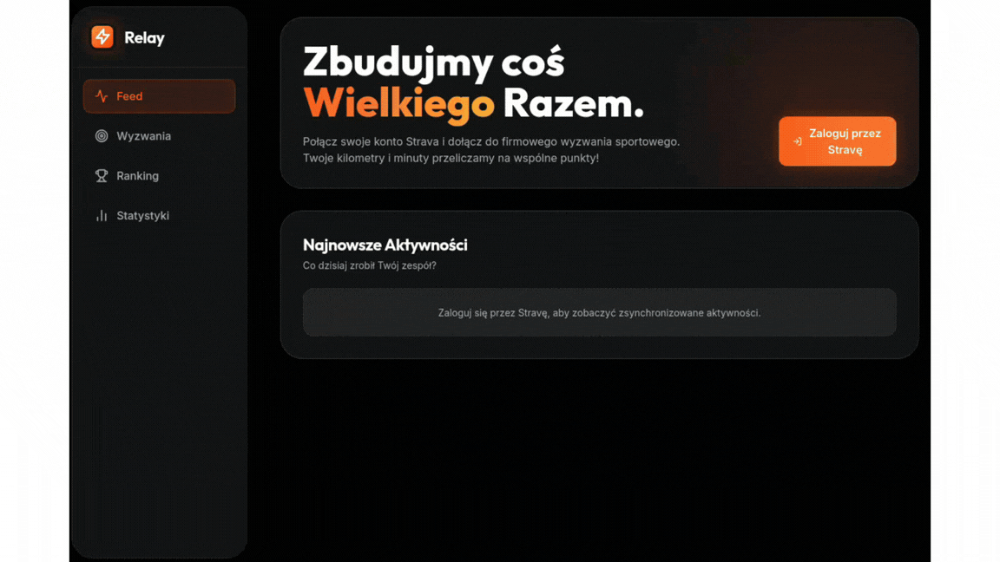

# Relay

Relay to w pełni responsywna, grywalizacyjna aplikacja webowa typu fullstack stworzona z myślą o firmach i zespołach. Umożliwia ona integrację ze Stravą, zbierając aktywności pracowników (np. bieganie, jazda na rowerze, joga, wspinaczka) i przeliczając je na zunifikowane punkty zespołu (**Team Points - TP**). Głównym celem aplikacji jest budowanie zaangażowania, zdrowej rywalizacji oraz realizowanie wspólnych celów sportowych w firmie.

## Demo

### Logowanie przez konto Strava


### Dashboard


### Ranking i statystyki


### Panel admina: Synchronizacja ze Strava


### Panel admina: Aktualizowanie wyzwań


## Funkcjonalności

*   **Integracja ze Strava:** Automatyczne pobieranie treningów za pomocą uwierzytelniania OAuth2.
*   **Team Points (TP):** punkty przydzielane za czas i rodzaj aktywności.
*   **Wyzwania i Pasek Postępu:** Zbiorczy cel zespołu z wizualizacją postępu.
*   **Aktywność:** Oś czasu pokazująca aktywności wszystkich pracowników. Możliwość przybijania dodania reakcji współpracownikom z aktualizowaniem UI.
*   **Ranking:** Tabele wyników z medalami dla TOP 3.
*   **Profile i Odznaki:** Indywidualny profil każdego pracownika z jego aktywnym streakiem oraz dynamicznie przyznawanymi odznakami.
*   **Panel Administratora:** Możliwość tworzenia nowych wyzwań i wymuszania natychmiastowej synchronizacji ze Stravą z poziomu UI.

## Opis Techniczny

Aplikacja składa się z dwóch niezależnych modułów połączonych API REST-owym.

### Backend (Java / Spring Boot)
*   **Stack:** Java 17, Spring Boot 4.0.6, Spring Web, Spring Data JPA, Spring Security (OAuth2).
*   **Baza danych:** SQLite
*   **Architektura:** Wzorzec MVC, separacja warstwy dostępu do danych, logiki biznesowej i kontrolerów REST.

### Frontend (React / Vite / TailwindCSS)
*   **Stack:** React 18, Vite, React Router DOM, Tailwind CSS.
*   **Wizualizacja:** `recharts` do generowania zaawansowanych wykresów, `lucide-react` do ikon.

## Instrukcja uruchomienia lokalnie

Aby uruchomić aplikację, należy posiadać:
- **Java 17+**
- **Node.js (v18+)** 

Potrzebna jest również aplikacja zarejestrowana w portalu deweloperskim Stravy, aby otrzymać `Client ID` oraz `Client Secret`.

### 1. Klonowanie repozytorium
```bash
git clone https://github.com/twoja-nazwa/Relay.git
cd Relay
```

### 2. Uruchomienie Backend'u (Spring Boot)
1. Przejdź do folderu `backend`:
   ```bash
   cd backend
   ```
2. Stwórz plik `.env` na wzór `.env.example`. Wpisz tam dane z API Stravy.
   ```bash
   STRAVA_CLIENT_ID="twoje_id"
   STRAVA_CLIENT_SECRET="twoj_secret"
   ```
3. Uruchom serwer:
   ```bash
   ./mvnw spring-boot:run
   ```
   *Backend uruchomi się na porcie 8080.*

### 3. Uruchomienie Front-endu (React / Vite)
1. Otwórz nową zakładkę terminala i przejdź do folderu `frontend`:
   ```bash
   cd frontend
   ```
2. Zainstaluj zależności:
   ```bash
   npm install
   ```
3. Uruchom serwer deweloperski:
   ```bash
   npm run dev
   ```
4. Otwórz przeglądarkę i wejdź pod adres `http://localhost:5173`. Kliknij "Zaloguj przez Stravę", aby rozpocząć

---

## Wykorzystanie narzędzi AI

Projekt został zrealizowany jako AI-Assisted Development, wykorzystując specjalistyczne modele LLM oraz systemy agentowe do optymalizacji różnych faz cyklu wytwarzania oprogramowania. Zastosowano architekturę podziału kompetencji między różnymi narzędziami:

1. **Codex:** Model ten został wykorzystany w fazie inicjalizacji do szybkiego wygenerowania szkieletu backendu i frontendu. Odpowiadał za setup środowiska (Spring Boot, Vite + React), podstawową konfigurację narzędzi buildujących, instalację zależności oraz wygenerowanie bazowego kodu konfiguracyjnego, co zredukowało czas potrzebny na setup.

2. **Antigravity:** Główny system agentowy do współpracy nad kodem. Odpowiadał za stworzenie interfejsu, podział na komponenty React oraz implementację logiki zarządzania stanem i routingiem. Generował całkowicie UI.

3. **Zarządzanie Kontekstem, system prompt:** W celu utrzymania spójności generowanego kodu, repozytorium zawiera dedykowany katalog `docs/`. Pliki znajdujące się w nim pełnią rolę system promptów trzymających kontekst dla każdego modelu LLM pracującego z kodem. Wymuszają one ścisłe przestrzeganie architektury oraz konwencji nazewnictwa.
